```mermaid
classDiagram
    class Main {
        +main(): int
    }

    class Torneo {
        -nombreTorneo: string
        -guildJugador: Guild*
        -guildsEnemigas: vector~Guild*~
        -inventario: Inventario*
        
        -crearNuevoHeroe(): void
        -consultarHeroeTorneo(): void
        -retirarHeroeTorneo(): void
        -mostrarGuildsRivales(): void
        -listarInventarioDetallado(): void
        -listarObjetosEquipadosHeroes(): void
        -asignarObjetoHeroe(): void
        -buscarObjetoEspecifico(): void
        
        +Torneo()
        +Torneo(nombre: string)
        +~Torneo()
        +inicializarTorneo(): void
        +inicializarGuilds(): void
        +inicializarInventario(): void
        +gestionarGuild(): void
        +gestionarInventario(): void
        +menuPrincipal(): void
    }

    class Guild {
        -nombreGuild: string
        -personajes: unordered_map~string, Personaje*~
        -muertos: unordered_map~string, Personaje*~
        
        +Guild()
        +Guild(nombre: string)
        +~Guild()
        +getNombreGuild(): string
        +cargarPersonajesIniciales(): void
        +agregarPersonaje(personaje: Personaje*): void
        +matarPersonaje(personaje: Personaje*): void
        +consultarPersonaje(nombre: string): void
        +listarPersonajes(): void
        +retirarPersonaje(nombre: string): void
        +buscarPersonaje(nombre: string): Personaje*
        +getPersonajesVivos(): vector~Personaje*~
        +getPersonajesMuertos(): vector~Personaje*~
        +getCantidadPersonajes(): int
    }

    class Inventario {
        -catalogoObjetos: unordered_map~string, ObjetoMagico*~
        
        +Inventario()
        +~Inventario()
        +cargarObjetosIniciales(): void
        +crearObjeto(objeto: ObjetoMagico*, stockInicial: int): void
        +listarObjetos(): void
        +consultarObjeto(objeto: string): void
        +actualizarStock(objeto: string, nuevoStock: int): void
        +eliminarObjeto(objeto: string): void
        +asignarObjetoAPersonaje(objeto: string, personaje: Personaje*): void
        +retirarObjetoDePersonaje(personaje: Personaje*, indice: int): void
        +buscarObjeto(objeto: string): ObjetoMagico*
        +getStock(objeto: string): int
        +getStockTotal(): int
    }

    class Personaje {
        
        #nombre: string
        #rol: string
        #nivel: int
        #vidaMaxima: int
        #vidaActual: int
        #ataque: int
        #defensa: int
        #estaVivo: bool
        #objetosEquipados: ObjetoAsignado*[2]
        
        +Personaje()
        +Personaje(nombre: string, rol: string, nivel: int, vidaMax: int, ataque: int, defensa: int)
        +~Personaje()
        +getNombre(): string
        +getRol(): string
        +getNivel(): int
        +getVidaMaxima(): int
        +getVidaActual(): int
        +getAtaque(): int
        +getDefensa(): int
        +getIsEstaVivo(): bool
        +setVidaActual(vida: int): void
        +setAtaque(ataque: int): void
        +setDefensa(defensa: int): void
        +recibirDanio(danio: int): void
        +curar(cantidad: int): void
        +mostrarInformacion(): void
        +equiparObjeto(objeto: ObjetoAsignado*, slot: int): void
        +retirarObjeto(slot: int): void
        +getObjetoEquipado(slot: int): ObjetoAsignado*
        +realizarAccion(objetivo: Personaje*): void*
    }

    class Guerrero {
        -probabilidadCritico: float
        
        +Guerrero()
        +Guerrero(nombre: string, rol: string, nivel: int, vidaMax: int, ataque: int, defensa: int)
        +~Guerrero()
        +realizarAccion(objetivo: Personaje*): void
        +calcularDanioCritico(): int
        +isEsCritico(): bool
    }

    class Mago {
        -poderMagico: int
        -factorIgnorarDefensa: float
        
        +Mago()
        +Mago(nombre: string, rol: string, nivel: int, vidaMax: int, ataque: int, defensa: int)
        +~Mago()
        +realizarAccion(objetivo: Personaje*): void
        +calcularDanioMagico(objetivo: Personaje*): int
    }

    class Sanador {
        -poderCuracion: int
        -efectividadCuracion: float
        
        +Sanador()
        +Sanador(nombre: string, rol: string, nivel: int, vidaMax: int, ataque: int)
        +~Sanador()
        +realizarAccion(objetivo: Personaje*): void
        +calcularCuracion(): int
    }

    class HechiceroOscuro {
        -poderOscuro: int
        -porcentajeDanioAOE: float
        -radioAOE: int
        
        +HechiceroOscuro()
        +HechiceroOscuro(nombre: string, rol: string, nivel: int, vidaMax: int, ataque: int, defensa: int)
        +~HechiceroOscuro()
        +realizarAccion(objetivo: Personaje*): void
        +realizarAccionAOE(objetivos: vector~Personaje*~): void
    }

    class Paladin {
        -poderDivino: int
        -probabilidadEscudoSagrado: float
        -escudoActivado: bool
        
        +Paladin()
        +Paladin(nombre: string, rol: string, nivel: int, vidaMax: int, ataque: int, defensa: int)
        +~Paladin()
        +realizarAccion(objetivo: Personaje*): void
        +protegerAliado(aliado: Personaje*, danio: int): void
        +bendiccionDivina(aliados: vector~Personaje*~): void
    }

    class ObjetoMagico {
        
        #nombre: string
        #descripcion: string
        #stock: int
        
        +ObjetoMagico()
        +ObjetoMagico(nombre: string, descripcion: string, stockInicial: int)
        +~ObjetoMagico()
        +getNombre(): string
        +getDescripcion(): string
        +getStock(): int
        +incrementarStock(): void
        +decrementarStock(): void
        +aplicarEfecto(personaje: Personaje*): void*
        +mostrarInfo(): void
    }

    class ObjetoAsignado {
        -tipoObjeto: ObjetoMagico*
        -usado: bool
        
        +ObjetoAsignado(tipo: ObjetoMagico*)
        +~ObjetoAsignado()
        +getNombre(): string
        +getDescripcion(): string
        +estaUsado(): bool
        +marcarComoUsado(): void
        +aplicarEfecto(personaje: Personaje*): void
        +mostrarInfo(): void
    }

    class PocionVida {
        -cantidadCuracion: int
        
        +PocionVida()
        +PocionVida(nombre: string, descripcion: string, stockInicial: int, curacion: int)
        +~PocionVida()
        +aplicarEfecto(personaje: Personaje*): void
    }

    class AmuletoFuria {
        -aumentoAtaque: int
        
        +AmuletoFuria()
        +AmuletoFuria(nombre: string, descripcion: string, stockInicial: int, aumento: int)
        +~AmuletoFuria()
        +aplicarEfecto(personaje: Personaje*): void
    }

    class EscudoBendito {
        -aumentoDefensa: int
        
        +EscudoBendito()
        +EscudoBendito(nombre: string, descripcion: string, stockInicial: int, aumento: int)
        +~EscudoBendito()
        +aplicarEfecto(personaje: Personaje*): void
    }

    class PactoSangriento {
        -danioPropio: int
        -aumentoPoderTotal: int
        
        +PactoSangriento()
        +PactoSangriento(nombre: string, descripcion: string, stockInicial: int, danio: int, aumento: int)
        +~PactoSangriento()
        +aplicarEfecto(personaje: Personaje*): void
    }

    class CaballaLegendaria {
        -probabilidadMuerte: float
        
        +CaballaLegendaria()
        +CaballaLegendaria(nombre: string, descripcion: string, stockInicial: int)
        +~CaballaLegendaria()
        +aplicarEfecto(personaje: Personaje*): void
    }

    class Revivir {
        -vidaRestaurada: int
        
        +Revivir()
        +Revivir(nombre: string, descripcion: string, stockInicial: int, vida: int)
        +~Revivir()
        +aplicarEfecto(personaje: Personaje*): void
    }

    Main ..> Torneo
    Torneo *-- Guild
    Torneo *-- Inventario
    Guild *-- Personaje
    Personaje <|-- Guerrero
    Personaje <|-- Mago
    Personaje <|-- Sanador
    Personaje <|-- HechiceroOscuro
    Personaje <|-- Paladin
    Personaje *-- ObjetoAsignado
    ObjetoAsignado --> ObjetoMagico
    Inventario *-- ObjetoMagico
    ObjetoMagico <|-- PocionVida
    ObjetoMagico <|-- AmuletoFuria
    ObjetoMagico <|-- EscudoBendito
    ObjetoMagico <|-- PactoSangriento
    ObjetoMagico <|-- CaballaLegendaria
    ObjetoMagico <|-- Revivir
```

# Diagrama UML Ajustado - Proyecto Lyrenhold

Versión actualizada con todos los métodos implementados.

Los métodos marcados con (NUEVO) son métodos auxiliares agregados para mejorar la organización del código.

Este diagrama UML no cuenta con la clase Arena, ya que aun no ha sido implementada.

---

---

## Métodos auxiliares agregados

Estos métodos fueron agregados para mejorar la organización del código y separar responsabilidades.

En la clase Torneo (8 métodos privados):

- crearNuevoHeroe() - Encapsula la lógica de creación de un nuevo héroe.
- consultarHeroeTorneo() - Maneja la consulta de información de un héroe.
- retirarHeroeTorneo() - Gestiona el retiro de un héroe de la guild.
- mostrarGuildsRivales() - Muestra las guilds enemigas del torneo.
- listarInventarioDetallado() - Lista todos los objetos mágicos disponibles.
- listarObjetosEquipadosHeroes() - Muestra los objetos equipados de cada héroe.
- asignarObjetoHeroe() - Maneja la asignación de objetos a personajes.
- buscarObjetoEspecifico() - Busca y muestra información de un objeto específico.

Estos métodos evitan que gestionarGuild() y gestionarInventario() tengan cientos de líneas de código.

En la clase Inventario (1 método público):

- retirarObjetoDePersonaje() - Completa el CRUD de objetos equipados permitiendo retirar objetos de los personajes.

---
