```mermaid
classDiagram
    class Main {
        +main(): int
    }

    class Torneo {
        -nombreTorneo: string
        -guildJugador: Guild*
        -guildsEnemigas: vector~Guild*~
        -inventario: Inventario*
        -arena: Arena*
        
        -mostrarGuildsRivales(): void
        -pausar(milisegundos: int): void
        
        +Torneo()
        +Torneo(nombre: string)
        +~Torneo()
        +inicializarTorneo(): void
        +inicializarGuilds(): void
        +inicializarInventario(): void
        +iniciarArena(): void
        +gestionarGuild(): void
        +gestionarInventario(): void
        +menuPrincipal(): void
    }

    class Guild {
        -nombreGuild: string
        -personajes: unordered_map~string, Personaje*~
        -muertos: unordered_map~string, Personaje*~
        
        +Guild()
        +Guild(nombre: string)
        +~Guild()
        +getNombreGuild(): string
        +cargarPersonajesIniciales(): void
        +agregarPersonaje(personaje: Personaje*): void
        +matarPersonaje(personaje: Personaje*): void
        +consultarPersonaje(nombre: string): void
        +listarPersonajes(): void
        +retirarPersonaje(nombre: string): void
        +buscarPersonaje(nombre: string): Personaje*
        +getPersonajesVivos(): vector~Personaje*~
        +getPersonajesMuertos(): vector~Personaje*~
        +getCantidadPersonajes(): int
        +crearNuevoPersonaje(): void
        +consultarPersonajeInteractivo(): void
        +retirarPersonajeInteractivo(inventario: Inventario*): void
        +mostrarDetallesGuild(): void
        +mostrarObjetosEquipadosHeroes(): void
        +guardarHeroesEnJSON(nombreArchivo: string): void
        +cargarHeroesDesdeJSON(nombreArchivo: string): void
    }

    class Arena {
        -heroes: vector~Personaje*~
        -enemigos: vector~Personaje*~
        -inventario: Inventario*
        -turnoActual: int
        -objetosUsados: int
        -combateActivo: bool
        
        -seleccionarObjetivoAleatorio(equipo: vector~Personaje*~): Personaje*
        -ejecutarAccionEnemigo(enemigo: Personaje*): void
        -ejecutarAccionHeroe(heroe: Personaje*): void
        -mostrarMenuAcciones(heroe: Personaje*): void
        -isEquipoDerrotado(equipo: vector~Personaje*~): bool
        -contarVivos(equipo: vector~Personaje*~): int
        -mostrarListaObjetivos(equipo: vector~Personaje*~, soloVivos: bool): void
        -pausar(milisegundos: int): void
        -procesarEfectosTemporales(): void
        
        +Arena()
        +~Arena()
        +setInventario(inv: Inventario*): void
        +iniciarCombate(heroes: vector~Personaje*~, enemigos: vector~Personaje*~): void
        +ejecutarTurno(): void
        +verificarFinCombate(): bool
        +mostrarEstadoCombate(): void
        +mostrarResumenFinal(): void
        +procesarObjetosPostCombate(): void
        +getTurnoActual(): int
        +getObjetosUsados(): int
        +isCombateActivo(): bool
    }

    class Inventario {
        -catalogoObjetos: unordered_map~string, ObjetoMagico*~
        
        -pausar(milisegundos: int): void
        
        +Inventario()
        +~Inventario()
        +cargarObjetosIniciales(): void
        +crearObjeto(objeto: ObjetoMagico*, stockInicial: int): void
        +listarObjetos(): void
        +consultarObjeto(nombre: string): void
        +actualizarStock(nombre: string, nuevoStock: int): void
        +eliminarObjeto(nombre: string): void
        +asignarObjetoAPersonaje(nombre: string, personaje: Personaje*): void
        +retirarObjetoDePersonaje(personaje: Personaje*, indice: int): void
        +buscarObjeto(nombre: string): ObjetoMagico*
        +getStock(nombre: string): int
        +getStockTotal(): int
        +asignarObjetoInteractivo(guildJugador: Guild*): void
        +retirarObjetoInteractivo(guildJugador: Guild*): void
        +consultarObjetoInteractivo(): void
        +actualizarStockInteractivo(): void
        +eliminarObjetoInteractivo(guildJugador: Guild*, guildsEnemigas: vector~Guild*~): void
        +crearObjetoDesdeMenu(): void
        +mostrarInventarioDetallado(): void
    }

    class Personaje {
        #nombre: string
        #rol: string
        #bando: string
        #nivel: int
        #vida: int
        #vidaMaxima: int
        #ataque: int
        #defensa: int
        #isEstaVivo: bool
        #isTieneEscudoProtector: bool
        #objetosEquipados: vector~ObjetoAsignado*~
        #bonusAtaqueTemporal: int
        #turnosBuffAtaque: int
        #bonusDefensaTemporal: int
        #turnosBuffDefensa: int
        #bonusVidaTemporal: int
        #turnosBuffVida: int
        
        #pausar(milisegundos: int): void
        #seleccionarObjetivo(objetivos: vector~Personaje*~, mensaje: string): Personaje*
        
        +Personaje()
        +Personaje(nombre: string, rol: string, bando: string, nivel: int, vida: int, ataque: int, defensa: int)
        +~Personaje()
        +getNombre(): string
        +getRol(): string
        +getBando(): string
        +getVida(): int
        +getVidaMaxima(): int
        +getAtaque(): int
        +getDefensa(): int
        +getNivel(): int
        +getIsEstaVivo(): bool
        +getEscudoProtector(): bool
        +setVida(vida: int): void
        +setVidaMaxima(vidaMaxima: int): void
        +setAtaque(ataque: int): void
        +setDefensa(defensa: int): void
        +setEstaVivo(estado: bool): void
        +setEscudoProtector(estado: bool): void
        +realizarAccion(objetivo: Personaje*): void
        +realizarAccionIA(aliados: vector~Personaje*~, enemigos: vector~Personaje*~): void
        +realizarAccionJugador(aliados: vector~Personaje*~, enemigos: vector~Personaje*~): bool
        +mostrarInformacion(): void
        +recibirDanio(danio: int): void
        +equiparObjeto(objeto: ObjetoAsignado*): void
        +usarObjeto(indice: int, aliados: vector~Personaje*~, enemigos: vector~Personaje*~): void
        +retirarObjeto(indice: int): void
        +isPuedeEquiparObjeto(): bool
        +getObjetoEquipado(indice: int): ObjetoAsignado*
        +mostrarObjetosEquipados(): void
        +aplicarBuffAtaque(valor: int, turnos: int): void
        +aplicarBuffDefensa(valor: int, turnos: int): void
        +aplicarBuffVida(valor: int, turnos: int): void
        +procesarBuffs(): void
        +tieneBuffAtaque(): bool
        +tieneBuffDefensa(): bool
        +tieneBuffVida(): bool
    }

    class Guerrero {
        -probabilidadCritico: double
        
        -isEsCritico(): bool
        -calcularDanioCritico(danioBase: int): int
        
        +Guerrero()
        +Guerrero(nombre: string, bando: string, nivel: int, vida: int, ataque: int, defensa: int)
        +~Guerrero()
        +realizarAccion(objetivo: Personaje*): void
        +realizarAccionIA(aliados: vector~Personaje*~, enemigos: vector~Personaje*~): void
        +realizarAccionJugador(aliados: vector~Personaje*~, enemigos: vector~Personaje*~): bool
        +mostrarInformacion(): void
    }

    class Mago {
        -poderMagico: int
        -factorIgnorarDefensa: double
        
        -calcularDanioMagico(): int
        
        +Mago()
        +Mago(nombre: string, bando: string, nivel: int, vida: int, ataque: int, defensa: int)
        +~Mago()
        +realizarAccion(objetivo: Personaje*): void
        +realizarAccionIA(aliados: vector~Personaje*~, enemigos: vector~Personaje*~): void
        +realizarAccionJugador(aliados: vector~Personaje*~, enemigos: vector~Personaje*~): bool
        +mostrarInformacion(): void
    }

    class Sanador {
        -poderCuracion: int
        -efectividadCuracion: double
        
        -calcularCuracion(): int
        
        +Sanador()
        +Sanador(nombre: string, bando: string, nivel: int, vida: int, defensa: int)
        +~Sanador()
        +realizarAccion(objetivo: Personaje*): void
        +realizarAccionIA(aliados: vector~Personaje*~, enemigos: vector~Personaje*~): void
        +realizarAccionJugador(aliados: vector~Personaje*~, enemigos: vector~Personaje*~): bool
        +mostrarInformacion(): void
    }

    class HechiceroOscuro {
        -poderOscuro: int
        -porcentajeDanioAOE: double
        -radioAOE: int
        
        -calcularDanioOscuro(): int
        -calcularDanioColateral(danioBase: int): int
        
        +HechiceroOscuro()
        +HechiceroOscuro(nombre: string, bando: string, nivel: int, vida: int, ataque: int, defensa: int)
        +~HechiceroOscuro()
        +realizarAccion(objetivo: Personaje*): void
        +realizarAccionIA(aliados: vector~Personaje*~, enemigos: vector~Personaje*~): void
        +realizarAccionJugador(aliados: vector~Personaje*~, enemigos: vector~Personaje*~): bool
        +realizarAccionAOE(aliados: vector~Personaje*~, enemigos: vector~Personaje*~): void
        +mostrarInformacion(): void
        +getPoderOscuro(): int
        +getPorcentajeDanioAOE(): double
        +getRadioAOE(): int
    }

    class Paladin {
        -poderDivino: int
        -probabilidadEscudoSagrado: double
        -escudoActivado: bool
        -contadorTurnos: int
        
        -calcularDanioDivino(): int
        
        +Paladin()
        +Paladin(nombre: string, bando: string, nivel: int, vida: int, ataque: int, defensa: int)
        +~Paladin()
        +realizarAccion(objetivo: Personaje*): void
        +realizarAccionIA(aliados: vector~Personaje*~, enemigos: vector~Personaje*~): void
        +realizarAccionJugador(aliados: vector~Personaje*~, enemigos: vector~Personaje*~): bool
        +mostrarInformacion(): void
        +protegerAliado(aliado: Personaje*): void
        +bendiccionDivina(aliado: Personaje*): void
        +activarEscudoSagrado(): bool
        +getPoderDivino(): int
        +getProbabilidadEscudoSagrado(): double
        +getEscudoActivado(): bool
    }

    class ObjetoMagico {
        #nombre: string
        #descripcion: string
        #stockDisponible: int
        
        #pausar(milisegundos: int): void
        
        +ObjetoMagico()
        +ObjetoMagico(nombre: string, descripcion: string, stockDisponible: int)
        +~ObjetoMagico()
        +aplicarEfecto(usuario: Personaje*, aliados: vector~Personaje*~, enemigos: vector~Personaje*~, instancia: ObjetoAsignado*): void
        +mostrarInformacion(): void
        +getTurnosEfecto(): int
        +revertirEfecto(personaje: Personaje*, instancia: ObjetoAsignado*): void
        +decrementarStock(): void
        +incrementarStock(): void
        +getNombre(): string
        +getDescription(): string
        +getStock(): int
        +setStock(stock: int): void
    }

    class ObjetoAsignado {
        -tipoObjeto: ObjetoMagico*
        -usado: bool
        -personajeAfectado: Personaje*
        -turnosRestantes: int
        -ultimoAumento: int
        
        +ObjetoAsignado(tipo: ObjetoMagico*)
        +~ObjetoAsignado()
        +aplicarEfecto(usuario: Personaje*, aliados: vector~Personaje*~, enemigos: vector~Personaje*~): void
        +marcarUsado(): void
        +estaUsado(): bool
        +getTipoObjeto(): ObjetoMagico*
        +getNombre(): string
        +getUltimoAumento(): int
        +setUltimoAumento(aumento: int): void
        +procesarFinTurno(): void
        +tieneEfectoActivo(): bool
        +getTurnosRestantes(): int
    }

    class PocionVida {
        -curacionMinima: int
        -curacionMaxima: int
        
        -calcularEfecto(): int
        
        +PocionVida(stock: int)
        +~PocionVida()
        +aplicarEfecto(usuario: Personaje*, aliados: vector~Personaje*~, enemigos: vector~Personaje*~, instancia: ObjetoAsignado*): void
        +mostrarInformacion(): void
        +getCuracionMinima(): int
        +getCuracionMaxima(): int
        +setCuracionMinima(valor: int): void
        +setCuracionMaxima(valor: int): void
    }

    class AmuletoFuria {
        -aumentoAtaqueMin: int
        -aumentoAtaqueMax: int
        -turnos: int
        
        -calcularEfecto(): int
        
        +AmuletoFuria(stock: int)
        +~AmuletoFuria()
        +aplicarEfecto(usuario: Personaje*, aliados: vector~Personaje*~, enemigos: vector~Personaje*~, instancia: ObjetoAsignado*): void
        +mostrarInformacion(): void
        +getTurnosEfecto(): int
        +revertirEfecto(personaje: Personaje*, instancia: ObjetoAsignado*): void
        +getAumentoAtaqueMin(): int
        +getAumentoAtaqueMax(): int
        +getTurnos(): int
        +setAumentoAtaqueMin(valor: int): void
        +setAumentoAtaqueMax(valor: int): void
        +setTurnos(turnos: int): void
    }

    class EscudoBendito {
        -aumentoDefensaMin: int
        -aumentoDefensaMax: int
        -turnos: int
        
        -calcularEfecto(): int
        
        +EscudoBendito(stock: int)
        +~EscudoBendito()
        +aplicarEfecto(usuario: Personaje*, aliados: vector~Personaje*~, enemigos: vector~Personaje*~, instancia: ObjetoAsignado*): void
        +mostrarInformacion(): void
        +getTurnosEfecto(): int
        +revertirEfecto(personaje: Personaje*, instancia: ObjetoAsignado*): void
        +getAumentoDefensaMin(): int
        +getAumentoDefensaMax(): int
        +getTurnos(): int
        +setDefensaMin(valor: int): void
        +setDefensaMax(valor: int): void
        +setTurnos(turnos: int): void
    }

    class PactoSangriento {
        -aumentoAtaqueMin: int
        -aumentoAtaqueMax: int
        -porcentajeVidaSacrificada: int
        
        -calcularAumentoAtaque(): int
        
        +PactoSangriento(stock: int)
        +~PactoSangriento()
        +aplicarEfecto(usuario: Personaje*, aliados: vector~Personaje*~, enemigos: vector~Personaje*~, instancia: ObjetoAsignado*): void
        +mostrarInformacion(): void
        +getAumentoAtaqueMin(): int
        +getAumentoAtaqueMax(): int
        +getPorcentajeVidaSacrificada(): int
        +setAumentoAtaqueMin(valor: int): void
        +setAumentoAtaqueMax(valor: int): void
        +setPorcentajeVidaSacrificada(porcentaje: int): void
    }

    class CaballaLegendaria {
        -probabilidadExito: double
        
        -calcularExito(): bool
        
        +CaballaLegendaria(stock: int)
        +~CaballaLegendaria()
        +aplicarEfecto(usuario: Personaje*, aliados: vector~Personaje*~, enemigos: vector~Personaje*~, instancia: ObjetoAsignado*): void
        +mostrarInformacion(): void
        +getProbabilidadExito(): double
    }

    class Revivir {
        +Revivir(stock: int)
        +~Revivir()
        +aplicarEfecto(usuario: Personaje*, aliados: vector~Personaje*~, enemigos: vector~Personaje*~, instancia: ObjetoAsignado*): void
        +mostrarInformacion(): void
    }

    Main ..> Torneo
    Torneo *-- Guild
    Torneo o-- Guild : guilds enemigas
    Torneo *-- Inventario
    Torneo *-- Arena
    Guild o-- Personaje
    Arena ..> Personaje
    Arena ..> Inventario
    Personaje <|-- Guerrero
    Personaje <|-- Mago
    Personaje <|-- Sanador
    Personaje <|-- HechiceroOscuro
    Personaje <|-- Paladin
    Personaje o-- ObjetoAsignado
    ObjetoAsignado --> ObjetoMagico
    Inventario o-- ObjetoMagico
    ObjetoMagico <|-- PocionVida
    ObjetoMagico <|-- AmuletoFuria
    ObjetoMagico <|-- EscudoBendito
    ObjetoMagico <|-- PactoSangriento
    ObjetoMagico <|-- CaballaLegendaria
    ObjetoMagico <|-- Revivir
```

# Diagrama UML Final - Proyecto Lyrenhold

Versión final con todas las clases, métodos y relaciones implementadas.

Este diagrama refleja el estado actual del proyecto después de integrar la Arena, el sistema de combate, la persistencia JSON y los efectos temporales.

---

---

## Resumen de Cambios desde la Version Ajustada

### Clase Arena (Nueva)
Sistema completo de combate por turnos con:
- Manejo de turnos alternados entre heroes y enemigos.
- IA para comportamiento de enemigos segun su rol.
- Procesamiento de efectos temporales al final de cada turno.
- Verificacion de victoria/derrota despues de cada accion.
- Resumen final del combate con estadisticas.

### Clase Personaje (Ampliada)
- Sistema de buffs temporales (bonusAtaqueTemporal, bonusDefensaTemporal, bonusVidaTemporal).
- Metodo seleccionarObjetivo() para encapsular la seleccion de objetivos.
- Atributo isTieneEscudoProtector para bloquear ataques.
- Metodos realizarAccionIA() y realizarAccionJugador() para separar logica de IA y jugador.

### Nuevos Roles de Personaje
- HechiceroOscuro: Ataque AOE que daña a aliados y enemigos, sacrifica vida propia.
- Paladin: Puede atacar, proteger aliados con escudo, o dar bendicion de defensa.

### Nuevos Objetos Magicos
- PactoSangriento: Sacrifica vida por aumento de ataque permanente.
- CaballaLegendaria: 50% de matar enemigo instantaneamente, 50% de morir.
- Revivir: Resucita aliados caidos con 50% de vida.

### Sistema de Efectos Temporales
- AmuletoFuria y EscudoBendito implementan getTurnosEfecto() y revertirEfecto().
- ObjetoAsignado maneja turnosRestantes y personajeAfectado.
- Arena procesa efectos al final de cada turno.

### Persistencia JSON
- Guild puede guardar y cargar heroes desde archivo JSON.
- Formato compacto de una linea por heroe.

### Mejoras de Encapsulamiento
- Metodos interactivos movidos de Torneo a Guild e Inventario.
- Cada clase maneja su propia logica de interaccion con el usuario.

---