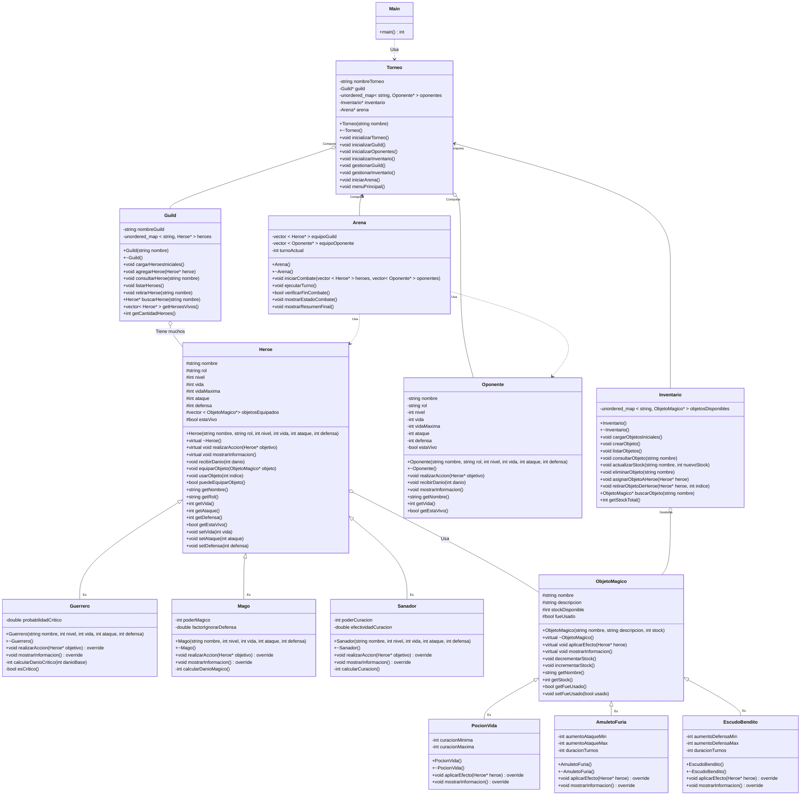

```mermaid

classDiagram
    %% Clase principal
    class Main{
        +main() int
    }

    %% Controlador principal del torneo
    class Torneo{
        -string nombreTorneo
        -Guild* guild
        -unordered_map< string, Oponente* > oponentes
        -Inventario* inventario
        -Arena* arena
        
        +Torneo(string nombre)
        +~Torneo()
        
        +void inicializarTorneo()
        +void inicializarGuild()
        +void inicializarOponentes()
        +void inicializarInventario()
        
        +void gestionarGuild()
        +void gestionarInventario()
        +void iniciarArena()
        
        +void menuPrincipal()
    }

    %% Gestiona los héroes del jugador
    class Guild{
        -string nombreGuild
        -unordered_map < string, Heroe* > heroes
        
        +Guild(string nombre)
        +~Guild()
        
        +void cargarHeroesIniciales()
        +void agregarHeroe(Heroe* heroe)
        +void consultarHeroe(string nombre)
        +void listarHeroes()
        +void retirarHeroe(string nombre)
        +Heroe* buscarHeroe(string nombre)
        
        +vector< Heroe* > getHeroesVivos()
        +int getCantidadHeroes()
    }

    %% Clase base para todos los héroes
    class Heroe{
        #string nombre
        #string rol
        #int nivel
        #int vida
        #int vidaMaxima
        #int ataque
        #int defensa
        #vector < ObjetoMagico*> objetosEquipados
        #bool estaVivo
        
        +Heroe(string nombre, string rol, int nivel, int vida, int ataque, int defensa)
        +virtual ~Heroe()
        
        +virtual void realizarAccion(Heroe* objetivo) 
        +virtual void mostrarInformacion()
        
        +void recibirDanio(int danio)
        +void equiparObjeto(ObjetoMagico* objeto)
        +void usarObjeto(int indice)
        +bool puedeEquiparObjeto()
        
        +string getNombre()
        +string getRol()
        +int getVida()
        +int getAtaque()
        +int getDefensa()
        +bool getEstaVivo()
        
        +void setVida(int vida)
        +void setAtaque(int ataque)
        +void setDefensa(int defensa)
    }

    %% Héroe especializado en ataques físicos
    class Guerrero{
        -double probabilidadCritico
        
        +Guerrero(string nombre, int nivel, int vida, int ataque, int defensa)
        +~Guerrero()
        
        +void realizarAccion(Heroe* objetivo) override
        +void mostrarInformacion() override
        
        -int calcularDanioCritico(int danioBase)
        -bool esCritico()
    }

    %% Héroe especializado en magia
    class Mago{
        -int poderMagico
        -double factorIgnorarDefensa
        
        +Mago(string nombre, int nivel, int vida, int ataque, int defensa)
        +~Mago()
        
        +void realizarAccion(Heroe* objetivo) override
        +void mostrarInformacion() override
        
        -int calcularDanioMagico()
    }

    %% Héroe especializado en curación
    class Sanador{
        -int poderCuracion
        -double efectividadCuracion
        
        +Sanador(string nombre, int nivel, int vida, int ataque, int defensa)
        +~Sanador()
        
        +void realizarAccion(Heroe* objetivo) override
        +void mostrarInformacion() override
        
        -int calcularCuracion()
    }

    %% Enemigos de la guild rival
    class Oponente{
        -string nombre
        -string rol
        -int nivel
        -int vida
        -int vidaMaxima
        -int ataque
        -int defensa
        -bool estaVivo
        
        +Oponente(string nombre, string rol, int nivel, int vida, int ataque, int defensa)
        +~Oponente()
        
        +void realizarAccion(Heroe* objetivo)
        +void recibirDanio(int danio)
        +void mostrarInformacion()
        
        +string getNombre()
        +int getVida()
        +bool getEstaVivo()
    }

    %% Gestiona los objetos mágicos del torneo
    class Inventario{
        -unordered_map < string, ObjetoMagico* > objetosDisponibles
        
        +Inventario()
        +~Inventario()
        
        +void cargarObjetosIniciales()
        +void crearObjeto()
        +void listarObjetos()
        +void consultarObjeto(string nombre)
        +void actualizarStock(string nombre, int nuevoStock)
        +void eliminarObjeto(string nombre)
        +void asignarObjetoAHeroe(Heroe* heroe)
        +void retirarObjetoDeHeroe(Heroe* heroe, int indice)
        
        +ObjetoMagico* buscarObjeto(string nombre)
        +int getStockTotal()
    }

    %% Clase base para objetos mágicos
    class ObjetoMagico{
        #string nombre
        #string descripcion
        #int stockDisponible
        #bool fueUsado
        
        +ObjetoMagico(string nombre, string descripcion, int stock)
        +virtual ~ObjetoMagico()
        
        +virtual void aplicarEfecto(Heroe* heroe)
        +virtual void mostrarInformacion()
        
        +void decrementarStock()
        +void incrementarStock()
        
        +string getNombre()
        +int getStock()
        +bool getFueUsado()
        +void setFueUsado(bool usado)
    }

    %% Restaura puntos de vida
    class PocionVida{
        -int curacionMinima
        -int curacionMaxima
        
        +PocionVida()
        +~PocionVida()
        
        +void aplicarEfecto(Heroe* heroe) override
        +void mostrarInformacion() override
    }

    %% Aumenta el ataque temporalmente
    class AmuletoFuria{
        -int aumentoAtaqueMin
        -int aumentoAtaqueMax
        -int duracionTurnos
        
        +AmuletoFuria()
        +~AmuletoFuria()
        
        +void aplicarEfecto(Heroe* heroe) override
        +void mostrarInformacion() override
    }

    %% Aumenta la defensa temporalmente
    class EscudoBendito{
        -int aumentoDefensaMin
        -int aumentoDefensaMax
        -int duracionTurnos
        
        +EscudoBendito()
        +~EscudoBendito()
        
        +void aplicarEfecto(Heroe* heroe) override
        +void mostrarInformacion() override
    }

    %% Controla los combates por turnos
    class Arena{
        -vector < Heroe* > equipoGuild
        -vector < Oponente* > equipoOponente
        -int turnoActual
        
        +Arena()
        +~Arena()
        
        +void iniciarCombate(vector < Heroe* > heroes, vector< Oponente* > oponentes)
        +void ejecutarTurno()
        +bool verificarFinCombate()
        +void mostrarEstadoCombate()
        +void mostrarResumenFinal()
    }

    %% Relaciones entre clases
    Main ..> Torneo : Usa
    
    Torneo "Compone" o-- Guild 
    Torneo "Compone" <-- Inventario 
    Torneo  "Compone" o-- Oponente 
    Torneo "Compone" <-- Arena 
    
    Guild o-- Heroe : Tiene muchos
    
    Heroe <|-- "Es" Guerrero 
    Heroe <|-- "Es" Mago 
    Heroe <|--  "Es" Sanador 
    
    Heroe o-- ObjetoMagico : Usa
    
    Inventario "Gestiona" o-- ObjetoMagico 
    
    ObjetoMagico <|-- "Es" PocionVida 
    ObjetoMagico <|-- "Es" AmuletoFuria 
    ObjetoMagico <|-- "Es" EscudoBendito 
    
    Arena "Usa"..> Heroe 
    Arena "Usa"..> Oponente 


```