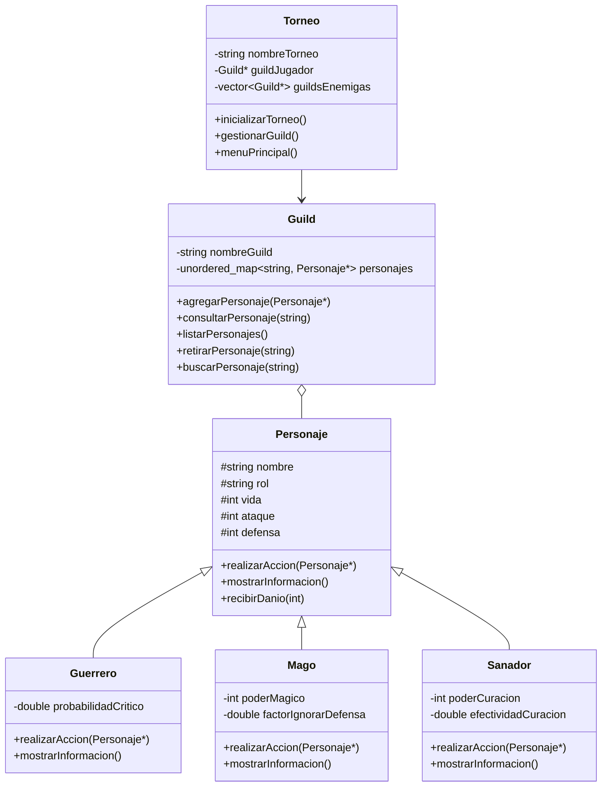

# Lyrenhold - Sistema de Torneo de Guilds

Proyecto final de Programación Orientada a Objetos 2025-2

## Descripción

Sistema de gestión de torneos donde diferentes guilds (gremios) compiten entre sí. Cada guild tiene héroes con roles únicos (Guerrero, Mago, Sanador) que pelean en una arena por turnos.

---

## Funcionalidades Actuales

**Implementación de Personajes y Guilds (Completada)**
- Crear y gestionar tu guild de héroes
- Agregar héroes nuevos de 3 tipos diferentes
- Consultar información detallada de cada héroe
- Ver las guilds enemigas y sus miembros
- Retirar héroes de tu guild

**Pendientes de Implementar**
- Gestionar inventario de objetos mágicos
- Equipar objetos a los héroes
- Combatir en la arena contra guilds enemigas

---

## Estructura del Proyecto
```
src/
├── Personajes/
│   ├── Personaje.h/cpp      Clase base abstracta
│   ├── Guerrero.h/cpp       Ataca con golpes críticos
│   ├── Mago.h/cpp           Ignora defensa enemiga
│   └── Sanador.h/cpp        Cura aliados
├── Guild/
│   └── Guild.h/cpp          Gestiona personajes del equipo
├── Torneo/
│   └── Torneo.h/cpp         Controlador principal con menús
└── main.cpp                 Punto de entrada
```

---

## Clases Principales

### Personaje (Clase Base)
Clase abstracta que define las características comunes de todos los héroes.

**Atributos protegidos:**
- nombre, rol, bando, nivel
- vida, vidaMaxima, ataque, defensa
- objetosEquipados, estaVivo

**Métodos abstractos:**
- `realizarAccion(Personaje* objetivo)` - Implementado por cada rol
- `mostrarInformacion()` - Muestra detalles del personaje

**Métodos de combate:**
- `recibirDanio(int danio)` - Calcula daño real con defensa
- `equiparObjeto(ObjetoAsignado* objeto)` - Equipa hasta 2 objetos
- `usarObjeto(int indice)` - Usa objeto equipado

### Guerrero
Especializado en ataques físicos con probabilidad de golpe crítico.

**Atributos privados:**
- `probabilidadCritico` - 25% de chance de crítico

**Implementación de realizarAccion():**
- Golpe normal: daño = ataque
- Golpe crítico: daño = ataque * 2
- No puede atacar aliados

### Mago
Especializado en magia que ignora parte de la defensa enemiga.

**Atributos privados:**
- `poderMagico` - Daño mágico adicional (30)
- `factorIgnorarDefensa` - Ignora 50% de defensa

**Implementación de realizarAccion():**
- Daño variable entre -5 y +15
- Reduce temporalmente defensa del objetivo
- Restaura defensa original después del ataque

### Sanador
Especializado en curación de aliados.

**Atributos privados:**
- `poderCuracion` - Poder de curación base (40)
- `efectividadCuracion` - Efectividad base (0.8)

**Implementación de realizarAccion():**
- Solo cura aliados del mismo bando
- Curación varía aleatoriamente (0-100% del poder)
- No puede exceder vida máxima del objetivo
- Puede fallar completamente (0%)

### Guild
Gestiona una colección de personajes usando unordered_map.

**Atributos privados:**
- `nombreGuild` - Nombre del gremio
- `personajes` - Mapa de nombre a puntero de Personaje

**Métodos públicos:**
- `cargarPersonajesIniciales()` - Crea 3 héroes base
- `agregarPersonaje(Personaje*)` - Agrega nuevo personaje (evita duplicados)
- `consultarPersonaje(string)` - Muestra info de un personaje
- `listarPersonajes()` - Lista todos los miembros
- `retirarPersonaje(string)` - Elimina y libera memoria
- `buscarPersonaje(string)` - Busca y retorna puntero
- `getPersonajesVivos()` - Retorna vector con personajes vivos
- `getCantidadPersonajes()` - Retorna total de personajes

### Torneo
Controlador principal del sistema que coordina guilds y menús.

**Atributos privados:**
- `nombreTorneo` - Nombre del torneo
- `guildJugador` - Guild controlada por el jugador
- `guildsEnemigas` - Vector de guilds rivales

**Métodos públicos:**
- `inicializarTorneo()` - Configura el sistema completo
- `inicializarGuilds()` - Crea guild del jugador y 3 enemigas
- `gestionarGuild()` - Menú de gestión de héroes
- `menuPrincipal()` - Menú principal del programa

**Métodos privados auxiliares:**
- `crearNuevoHeroe()` - Lógica de creación de héroes
- `consultarHeroeTorneo()` - Lógica de consulta interactiva
- `retirarHeroeTorneo()` - Lógica de retiro con confirmación
- `mostrarGuildsRivales()` - Muestra todas las guilds enemigas

---

## Diagrama UML

**Nota:** Este es el diseño inicial antes de programar. Durante el desarrollo se agregaron métodos auxiliares privados no mostrados aquí.


---

## Decisiones de Diseño

### Uso de unordered_map en Guild
La clase Guild usa un mapa desordenado para almacenar personajes:
- Búsqueda por nombre muy rápida
- Evita duplicados automáticamente
- Más eficiente que buscar linealmente en un vector

### Métodos auxiliares privados
Se extrajeron métodos auxiliares para mantener el código organizado:
- `crearNuevoHeroe()` encapsula toda la lógica de creación
- `consultarHeroeTorneo()` maneja la consulta interactiva
- `retirarHeroeTorneo()` gestiona el retiro con confirmación

Esto hace que los métodos de menú sean cortos y enfocados solo en navegación.

### Validación antes de crear objetos
Al agregar un héroe, primero se valida que el nombre no exista. Esto evita crear un objeto con `new` que luego se rechaza, previniendo memory leaks.

### Forward declaration (Nombre del metodo para evita los problemas de la dependencia circular)
Se usa `class ObjetoAsignado;` en Personaje.h para evitar dependencias circulares. El include completo va en Personaje.cpp donde realmente se usan los métodos. (por confirmar con la profesora)

---

## Gestión de Memoria

Todos los personajes y guilds se crean dinámicamente con `new`:
- Guild libera todos sus personajes en el destructor
- Torneo libera la guild del jugador y todas las enemigas
- Se usa `nullptr` para verificar punteros válidos antes de usar

Ejemplo del destructor de Guild:
```cpp
Guild::~Guild() {
    for (auto& par : personajes) {
        delete par.second;  // Libera cada personaje
    }
    personajes.clear();
}
```

---

## Polimorfismo Usado

Cada tipo de personaje implementa `realizarAccion()` de forma única:
```cpp
Personaje* heroe = new Guerrero("Stark", "Jugador", 2, 150, 35, 15);
heroe->realizarAccion(enemigo);  // Llama a Guerrero::realizarAccion()
```

El mismo código funciona con cualquier tipo de personaje gracias al polimorfismo.

---

## Ejemplo de Uso
```
========================================
     Gran Torneo de la Arena de Lyrenhold
========================================
1. Gestionar Guild
2. Gestionar Inventario (PENDIENTE)
3. Iniciar Arena (PENDIENTE)
4. Ver Guilds Enemigas
0. Salir del torneo
Seleccione una opción: 1

=== GESTIÓN DE GUILD ===
Guild: Heroes de Lyrenhold
1. Listar héroes
2. Consultar héroe
3. Agregar héroe
4. Retirar héroe
5. Volver al menú principal
Seleccione una opción: 1

======== Miembros de Heroes de Lyrenhold ========
1. Guerrero - Stark (Nivel 2) - Vivo
2. Mago - Fern (Nivel 1) - Vivo
3. Sanador - Sein (Nivel 1) - Vivo
Total de personajes: 3
```

---

## Próximas Implementaciones

- Sistema de Inventario con objetos mágicos
- Clases ObjetoMagico y ObjetoAsignado
- Sistema de combate por turnos en Arena
- Persistencia de datos en JSON
- Efectos temporales de objetos (buffs/debuffs)

---

## Equipo

Juan Felipe (Pipe)
Jose Ricardo (Richi)
Angel Obando

---