# Manual Técnico - El Gran Torneo de Lyrenhold

Sistema de gestión de torneos de guilds con combate por turnos.

Proyecto Final - Programación Orientada a Objetos 2025-2

---

## Descripción General

Este proyecto simula un torneo donde diferentes guilds (gremios) compiten entre sí. El jugador controla una guild de héroes que pueden combatir contra guilds enemigas en una arena por turnos. Cada héroe tiene un rol específico (Guerrero, Mago, Sanador, Paladín o Hechicero Oscuro) que determina cómo actúa en combate.

El sistema incluye:
- Gestión de personajes (crear, consultar, retirar)
- Inventario de objetos mágicos
- Sistema de combate por turnos
- Guardado y carga de datos en JSON

---

## Estructura del Proyecto

```
src/
├── main.cpp                    Punto de entrada del programa
├── Torneo/
│   ├── Torneo.h               Controlador principal
│   └── Torneo.cpp
├── Guild/
│   ├── Guild.h                Gestiona los personajes de un equipo
│   └── Guild.cpp
├── Arena/
│   ├── Arena.h                Sistema de combate por turnos
│   └── Arena.cpp
├── Personajes/
│   ├── Personaje.h            Clase base de todos los personajes
│   ├── Personaje.cpp
│   ├── Guerrero.h/cpp         Especializado en ataques físicos
│   ├── Mago.h/cpp             Especializado en magia
│   ├── Sanador.h/cpp          Especializado en curación
│   ├── Paladin.h/cpp          Defensa elevada y protección
│   └── HechiceroOscuro.h/cpp  Magia oscura con daño de área
├── Inventario/
│   ├── Inventario.h           Gestiona objetos mágicos del torneo
│   ├── Inventario.cpp
│   ├── ObjetoAsignado.h       Representa un objeto equipado
│   └── ObjetoAsignado.cpp
├── Objetos/
│   ├── ObjetoMagico.h         Clase base de objetos mágicos
│   ├── ObjetoMagico.cpp
│   ├── PocionVida.h/cpp       Restaura vida
│   ├── AmuletoFuria.h/cpp     Aumenta ataque temporalmente
│   ├── EscudoBendito.h/cpp    Aumenta defensa temporalmente
│   ├── PactoSangriento.h/cpp  Sacrifica vida por poder
│   ├── CaballaLegendaria.h/cpp 50% matar enemigo / 50% morir
│   └── Revivir.h/cpp          Resucita aliados caídos
└── ArchivosJson/
    └── heroes.json            Archivo de guardado
```

---

## Clases Principales

### Torneo

Es el controlador principal del sistema. Se encarga de inicializar todo (guilds, inventario, arena) y de manejar los menús.

**Atributos importantes:**
- `guildJugador`: Puntero a la guild que controla el jugador.
- `guildsEnemigas`: Vector con las guilds rivales.
- `inventario`: Puntero al inventario global de objetos.
- `arena`: Puntero al sistema de combate.

**Menú principal:**
```
========================================
     Gran Torneo de la Arena de Lyrenhold
========================================
1) Gestionar Guild.
2) Gestionar inventario.
3) Iniciar Arena (combates).
4) Ver Guilds enemigas.
5) Guardar heroes de la Guild en JSON.
6) Cargar heroes desde JSON.
0) Salir del torneo.
========================================
```

### Guild

Gestiona una colección de personajes usando `unordered_map`. La clave del mapa es el nombre del personaje, y el valor es un puntero al objeto Personaje.

**Por qué usamos unordered_map:**
- Búsqueda rápida por nombre.
- Evita duplicados automáticamente (no puede haber dos personajes con el mismo nombre).

**Métodos principales:**
- `cargarPersonajesIniciales()`: Crea 5 héroes base al iniciar.
- `agregarPersonaje()`: Añade un nuevo personaje verificando que no exista.
- `retirarPersonaje()`: Elimina un personaje y libera su memoria.
- `buscarPersonaje()`: Retorna el puntero al personaje o nullptr si no existe.
- `getPersonajesVivos()`: Retorna un vector solo con los personajes vivos.
- `guardarHeroesEnJSON()`: Guarda los héroes en un archivo.
- `cargarHeroesDesdeJSON()`: Carga héroes desde un archivo.

### Arena

Controla el sistema de combate por turnos. Recibe los personajes de ambos equipos y alterna sus turnos hasta que un equipo sea derrotado.

**Flujo del combate:**
1. `iniciarCombate()`: Recibe los héroes y enemigos, muestra los equipos.
2. `ejecutarTurno()`: Primero actúan todos los héroes, luego todos los enemigos.
3. `verificarFinCombate()`: Verifica si algún equipo perdió.
4. `mostrarResumenFinal()`: Muestra quién ganó y las estadísticas.
5. `procesarObjetosPostCombate()`: Retira los objetos usados.

**IA de los enemigos:**
Cada tipo de personaje tiene su propia lógica de IA en el método `realizarAccionIA()`:
- Guerrero: Ataca al enemigo con menos vida.
- Mago: Ataca al enemigo con mayor defensa (aprovecha que ignora defensa).
- Sanador: Cura al aliado más herido.
- Paladín: Protege aliados en peligro o ataca.
- Hechicero Oscuro: 40% usa AOE si hay 2+ enemigos, sino ataca al más fuerte.

### Personaje (Clase Base)

Es la clase abstracta de la que heredan todos los tipos de personajes. Define los atributos y métodos comunes.

**Atributos protegidos:**
- `nombre`, `rol`, `bando`: Identificación del personaje.
- `nivel`, `vida`, `vidaMaxima`, `ataque`, `defensa`: Estadísticas de combate.
- `isEstaVivo`: Si el personaje puede actuar.
- `isTieneEscudoProtector`: Si tiene un escudo que bloquea el próximo ataque.
- `objetosEquipados`: Vector de punteros a ObjetoAsignado (máximo 2).
- Atributos de buffs temporales para efectos de habilidades.

**Métodos abstractos (las clases hijas los implementan):**
- `realizarAccion()`: La acción principal del personaje.
- `realizarAccionIA()`: Cómo actúa cuando es controlado por la IA.
- `realizarAccionJugador()`: Cómo actúa cuando es controlado por el jugador.
- `mostrarInformacion()`: Muestra los detalles del personaje.

**Método recibirDanio():**
```cpp
void Personaje::recibirDanio(int danio) {
    // Si tiene escudo, bloquea completamente el ataque
    if (this->isTieneEscudoProtector) {
        cout << "¡¡¡ESCUDO PROTECTOR ACTIVADO!!!" << endl;
        this->isTieneEscudoProtector = false;
        return;
    }
    
    // Calcula daño real considerando defensa
    int danioReal = danio - this->defensa;
    if (danioReal < 0) {
        danioReal = 0;
    }
    
    this->vida -= danioReal;
    
    // Verifica si murió
    if (this->vida <= 0) {
        this->vida = 0;
        this->isEstaVivo = false;
    }
}
```

### Clases Hijas de Personaje

**Guerrero:**
- Tiene 25% de probabilidad de golpe crítico (doble daño).
- Alta vida y defensa.
- IA: Ataca al enemigo con menos vida para eliminarlo rápido.

**Mago:**
- Sus ataques ignoran el 50% de la defensa enemiga.
- Daño variable con poder mágico adicional.
- Poca defensa pero mucho daño.
- IA: Ataca al enemigo con mayor defensa.

**Sanador:**
- No ataca, solo cura aliados.
- La curación tiene efectividad variable (puede fallar).
- IA: Cura al aliado más herido.

**Paladín:**
- Puede atacar, proteger aliados o dar bendición de defensa.
- `protegerAliado()`: 50% de éxito para dar escudo que bloquea 1 ataque.
- `bendiccionDivina()`: +15 defensa por 2 turnos.
- IA: Si un aliado tiene menos del 30% de vida, intenta protegerlo.

**Hechicero Oscuro:**
- Ataque normal cuesta 10% de su vida máxima.
- Puede atacar a aliados o enemigos.
- `realizarAccionAOE()`: Ataque de área que daña a todos, cuesta 15% de vida.
- IA: 40% de usar AOE si hay 2+ enemigos.

### Inventario

Gestiona el catálogo de objetos mágicos del torneo usando `unordered_map`. La clave es el nombre del objeto.

**Objetos iniciales:**
- 5 Pociones de Vida
- 3 Amuletos de Furia
- 3 Escudos Benditos
- 2 Pactos Sangrientos
- 1 Caballa Legendaria
- 2 Pociones de Resurrección

**Menú de inventario:**
```
=======$ GESTION DE INVENTARIO $========
Stock total: X objetos.
1) Crear objeto magico.
2) Listar objetos disponibles.
3) Consultar objeto especifico.
4) Actualizar stock de objeto.
5) Eliminar objeto (si stock = 0).
========================================
6) Asignar objeto a heroe.
7) Retirar objeto de heroe.
8) Ver objetos equipados por heroes.
0) Volver al menu principal.
========================================
```

### ObjetoMagico (Clase Base)

Clase abstracta para todos los objetos mágicos. Define el stock y los métodos que deben implementar las clases hijas.

**Métodos importantes:**
- `aplicarEfecto()`: Método abstracto que define qué hace el objeto.
- `getTurnosEfecto()`: Retorna cuántos turnos dura el efecto (0 si es instantáneo).
- `revertirEfecto()`: Revierte el efecto cuando expira (para objetos temporales).
- `incrementarStock()` / `decrementarStock()`: Maneja el stock disponible.

### ObjetoAsignado

Representa una instancia de un objeto equipado por un personaje. Guarda el puntero al tipo de objeto y si ya fue usado.

**Atributos importantes:**
- `tipoObjeto`: Puntero al ObjetoMagico del catálogo.
- `usado`: Si el objeto ya fue consumido.
- `personajeAfectado`: Para efectos temporales, quién recibió el efecto.
- `turnosRestantes`: Turnos que quedan del efecto.
- `ultimoAumento`: Guarda cuánto aumentó para poder revertirlo exactamente.

**Patrón de diseño:**
Esto funciona similar al patrón Flyweight. El catálogo (Inventario) tiene los tipos de objetos con su stock. Cuando se asigna un objeto a un personaje, se crea un ObjetoAsignado que apunta al tipo pero representa una instancia específica.

### Clases Hijas de ObjetoMagico

**PocionVida:**
- Cura entre 20 y 40 puntos de vida.
- Efecto instantáneo.

**AmuletoFuria:**
- Aumenta ataque entre 5 y 10 puntos.
- Dura 2 turnos, luego se revierte.

**EscudoBendito:**
- Aumenta defensa entre 10 y 20 puntos.
- Dura 1 turno, luego se revierte.

**PactoSangriento:**
- Sacrifica 30% de vida máxima.
- Aumenta ataque entre 25 y 40 puntos (permanente).
- No puede matarte, mínimo quedas con 1 de vida.

**CaballaLegendaria:**
- 50% de matar al enemigo seleccionado instantáneamente.
- 50% de morir tú.
- Permite seleccionar el objetivo.

**Revivir:**
- Permite seleccionar un aliado muerto.
- Lo revive con 50% de su vida máxima.

---

## Sistema de Combate

### Turno del Héroe (Jugador)

Cuando es el turno de un héroe del jugador, aparece este menú:

```
====== Turno de Stark (Guerrero) ======
Vida: 150/150 -- Defensa: 15 -- Ataque: 35
1. Realizar accion principal (atacar/curar segun rol).
2. Usar objeto equipado.
3. Ver estado del combate.
4. Saltar turno.
========================================
Seleccione una opcion:
```

Si elige la opción 1, cada rol muestra sus opciones específicas. Por ejemplo, el Paladín:

```
========================================
  El Paladin puede realizar diferentes acciones:
  1. Atacar a un enemigo (Justicia Divina)
  2. Otorgar Escudo Protector a un aliado (bloquea 1 ataque)
  3. Bendicion Divina a un aliado (+15 defensa por dos turnos)
  0. Cancelar
========================================
```

### Turno del Enemigo (IA)

Los enemigos actúan automáticamente según su rol. El método `realizarAccionIA()` de cada clase define el comportamiento:

```cpp
// Ejemplo: IA del Guerrero
void Guerrero::realizarAccionIA(vector<Personaje*> aliados, vector<Personaje*> enemigos) {
    // Busca al enemigo con menos vida
    Personaje* objetivo = nullptr;
    int menorVida = 9999;
    
    for (int i = 0; i < enemigos.size(); i++) {
        if (enemigos[i]->getIsEstaVivo() && enemigos[i]->getVida() < menorVida) {
            menorVida = enemigos[i]->getVida();
            objetivo = enemigos[i];
        }
    }
    
    if (objetivo != nullptr) {
        realizarAccion(objetivo);
    }
}
```

### Efectos Temporales

Al final de cada turno, la Arena procesa los efectos temporales:

1. Revisa los objetos equipados de todos los personajes.
2. Si un objeto tiene efecto activo, decrementa los turnos restantes.
3. Si los turnos llegan a 0, llama a `revertirEfecto()` del objeto.
4. También procesa los buffs de habilidades (como Bendición Divina).

```
--- Procesando efectos temporales ---
 >> El efecto del [Amuleto de Furia] ha expirado!!!!
 Ataque de Stark restaurado: 45 --> 35
```

### Fin del Combate

El combate termina cuando todos los miembros de un equipo mueren:

```
===============================================
            FIN DEL COMBATE
===============================================

*** VICTORIA PARA LA GUILD DEL JUGADOR! ***
Motivo: Todos los oponentes han sido derrotados.

Heroes supervivientes: Stark, Fern
Duracion del combate: 7 turnos
Objetos magicos usados: 2
===============================================
```

---

## Persistencia en JSON

### Formato del archivo

Cada héroe se guarda en una línea con formato JSON:

```json
{"nombre":"Stark","rol":"Guerrero","nivel":2,"vida":150,"vidaMaxima":150,"ataque":35,"defensa":15}
{"nombre":"Fern","rol":"Mago","nivel":1,"vida":80,"vidaMaxima":80,"ataque":45,"defensa":5}
```

### Guardar héroes

El método `guardarHeroesEnJSON()` de Guild recorre todos los personajes y escribe cada uno en una línea:

```cpp
for (int i = 0; i < todosLosHeroes.size(); i++) {
    Personaje* h = todosLosHeroes[i];
    
    archivo << "{\"nombre\":\"" << h->getNombre() << "\","
            << "\"rol\":\"" << h->getRol() << "\","
            << "\"nivel\":" << h->getNivel() << ","
            << "\"vida\":" << h->getVida() << ","
            << "\"vidaMaxima\":" << h->getVidaMaxima() << ","
            << "\"ataque\":" << h->getAtaque() << ","
            << "\"defensa\":" << h->getDefensa() << "}" << endl;
}
```

### Cargar héroes

El método `cargarHeroesDesdeJSON()` lee línea por línea y extrae los valores buscando las claves:

```cpp
// Extraer nombre
size_t posNombre = linea.find("\"nombre\":\"");
size_t inicioNombre = posNombre + 10;
size_t finNombre = linea.find("\"", inicioNombre);
string nombre = linea.substr(inicioNombre, finNombre - inicioNombre);
```

Si el héroe ya existe, actualiza sus estadísticas. Si no existe, crea uno nuevo según el rol.

---

## Gestión de Memoria

### Quién es dueño de qué

- **Guild** es dueña de sus Personajes (los crea y destruye).
- **Inventario** es dueño de los ObjetoMagico del catálogo.
- **Personaje** es dueño de sus ObjetoAsignado equipados.
- **Arena** NO es dueña de nada, solo usa punteros prestados.
- **Torneo** es dueño de la Guild del jugador, las guilds enemigas, el Inventario y la Arena.

### Destructores

Cada clase libera lo que le pertenece:

```cpp
Guild::~Guild() {
    // Libera todos los personajes
    for (pair<string, Personaje*> par : this->personajes) {
        delete par.second;
    }
    this->personajes.clear();
}

Personaje::~Personaje() {
    // Libera los objetos equipados
    for (int i = 0; i < this->objetosEquipados.size(); i++) {
        delete objetosEquipados[i];
    }
    this->objetosEquipados.clear();
}
```

### Validación antes de crear

Cuando agregamos un personaje, primero verificamos que no exista para evitar crear memoria que luego se rechaza:

```cpp
void Guild::agregarPersonaje(Personaje* personaje) {
    string nombre = personaje->getNombre();
    
    // Verifica primero
    if (this->personajes.find(nombre) != this->personajes.end()) {
        cout << "Error: Ya existe un personaje llamado " << nombre << endl;
        return;  // No se agregó, el que llamó debe liberar la memoria
    }
    
    personajes[nombre] = personaje;
}
```

---

## Decisiones de Diseño

### Forward Declarations

Para evitar dependencias circulares, usamos declaraciones adelantadas en los headers:

```cpp
// En Personaje.h
class ObjetoAsignado;  // Forward declaration

// El include completo va en Personaje.cpp
#include "../Inventario/ObjetoAsignado.h"
```

### Métodos virtuales puros

Los métodos `realizarAccion()`, `realizarAccionIA()`, `realizarAccionJugador()` y `mostrarInformacion()` son virtuales puros en Personaje:

```cpp
virtual void realizarAccion(Personaje* objetivo) = 0;
```

Esto obliga a cada clase hija a implementar su propia versión, y permite usar polimorfismo:

```cpp
Personaje* heroe = new Guerrero("Stark", "Jugador", 2, 150, 35, 15);
heroe->realizarAccion(enemigo);  // Llama a Guerrero::realizarAccion()
```

### Separación de IA y Jugador

Cada personaje tiene dos métodos para actuar:
- `realizarAccionIA()`: Para cuando la IA controla al personaje (enemigos).
- `realizarAccionJugador()`: Para cuando el jugador controla al personaje.

Ambos terminan llamando a `realizarAccion()` con el objetivo seleccionado.

---


---

## Diagramas UML por Etapas del Proyecto

A lo largo del desarrollo de *El Gran Torneo de Lyrenhold* el diseño de clases fue evolucionando.  
En esta sección se incluyen los diagramas UML correspondientes a las tres etapas principales del proyecto.

### Versión inicial del diseño

Primer boceto del sistema, centrado en las clases básicas de torneo, guilds, personajes y objetos mágicos.

```mermaid

classDiagram
    %% Clase principal
    class Main{
        +main() int
    }

    %% Controlador principal del torneo
    class Torneo{
        -string nombreTorneo
        -Guild* guildJugador
        -vector< Guild* > guildsEnemigas  
        -Inventario* inventario
        -Arena* arena
        
        +Torneo(string nombre)
        +~Torneo()
        
        +void inicializarTorneo()
        +void inicializarGuilds()
        +void inicializarInventario()
        
        +void gestionarGuild()
        +void gestionarInventario()
        +void iniciarArena()
        
        +void menuPrincipal()
    }

    %% Gestiona personajes de un equipo
    class Guild{
        -string nombreGuild
        -unordered_map< string, Personaje* > personajes
        
        +Guild(string nombre)
        +~Guild()
        
        +void cargarPersonajesIniciales()
        +void agregarPersonaje(Personaje* personaje)
        +void consultarPersonaje(string nombre)
        +void listarPersonajes()
        +void retirarPersonaje(string nombre)
        +Personaje* buscarPersonaje(string nombre)
        
        +vector<Personaje*> getPersonajesVivos()
        +int getCantidadPersonajes()
    }

    %% Clase base para personajes
    class Personaje{
        #string nombre
        #string rol
        #string bando
        #int nivel
        #int vida
        #int vidaMaxima
        #int ataque
        #int defensa
        #vector<ObjetoAsignado*> objetosEquipados
        #bool estaVivo
        
        +Personaje(string nombre, string rol, string bando, int nivel, int vida, int ataque, int defensa)
        +virtual ~Personaje()
        
        +virtual void realizarAccion(Personaje* objetivo) 
        +virtual void mostrarInformacion()
        
        +void recibirDanio(int danio)
        +void equiparObjeto(ObjetoAsignado* objeto)
        +void usarObjeto(int indice)
        +bool puedeEquiparObjeto()
        +ObjetoAsignado* getObjetoEquipado(int indice)
        +void retirarObjeto(int indice)
        
        +string getNombre()
        +string getRol()
        +string getBando()
        +int getVida()
        +int getAtaque()
        +int getDefensa()
        +bool getEstaVivo()
        
        +void setVida(int vida)
        +void setAtaque(int ataque)
        +void setDefensa(int defensa)
    }

    %% Especializado en ataques físicos
    class Guerrero{
        -double probabilidadCritico
        
        +Guerrero(string nombre, string bando, int nivel, int vida, int ataque, int defensa)
        +~Guerrero()
        
        +void realizarAccion(Personaje* objetivo) override
        +void mostrarInformacion() override
        
        -int calcularDanioCritico(int danioBase)
        -bool esCritico()
    }

    %% Especializado en magia
    class Mago{
        -int poderMagico
        -double factorIgnorarDefensa
        
        +Mago(string nombre, string bando, int nivel, int vida, int ataque, int defensa)
        +~Mago()
        
        +void realizarAccion(Personaje* objetivo) override
        +void mostrarInformacion() override
        
        -int calcularDanioMagico()
    }

    %% Especializado en curación
    class Sanador{
        -int poderCuracion
        -double efectividadCuracion
        
        +Sanador(string nombre, string bando, int nivel, int vida, int defensa)
        +~Sanador()
        
        +void realizarAccion(Personaje* objetivo) override
        +void mostrarInformacion() override
        
        -int calcularCuracion()
    }

    %% Gestiona objetos mágicos del torneo
    class Inventario{
        -unordered_map< string, ObjetoMagico* > catalogoObjetos
        
        +Inventario()
        +~Inventario()
        
        +void cargarObjetosIniciales()
        +void crearObjeto(ObjetoMagico* objeto, int stockInicial)
        +void listarObjetos()
        +void consultarObjeto(string nombre)
        +void actualizarStock(string nombre, int nuevoStock)
        +void eliminarObjeto(string nombre)
        +void asignarObjetoAPersonaje(string nombre, Personaje* personaje)
        +void retirarObjetoDePersonaje(Personaje* personaje, int indice)
        
        +ObjetoMagico* buscarObjeto(string nombre)
        +int getStock(string nombre)
        +int getStockTotal()
    }

    %% Clase base para objetos mágicos (tipo con stock)
    class ObjetoMagico{
        #string nombre
        #string descripcion
        #int stockDisponible
        
        +ObjetoMagico(string nombre, string descripcion, int stock)
        +virtual ~ObjetoMagico()
        
        +virtual void aplicarEfecto(Personaje* personaje) = 0
        +virtual void mostrarInformacion()
        
        +void decrementarStock()
        +void incrementarStock()
        
        +string getNombre()
        +string getDescripcion()
        +int getStock()
    }

    %% Representa una instancia asignada a un personaje
    class ObjetoAsignado{
        -ObjetoMagico* tipoObjeto
        -bool usado
        
        +ObjetoAsignado(ObjetoMagico* tipo)
        +~ObjetoAsignado()
        
        +void aplicarEfecto(Personaje* personaje)
        +void marcarUsado()
        +bool estaUsado()
        +ObjetoMagico* getTipoObjeto()
        +string getNombre()
    }

    %% Restaura puntos de vida
    class PocionVida{
        -int curacionMinima
        -int curacionMaxima
        
        +PocionVida(int stock)
        +~PocionVida()
        
        +void aplicarEfecto(Personaje* personaje) override
        +void mostrarInformacion() override
        
        +int getCuracionMinima()
        +int getCuracionMaxima()
        +void setCuracionMinima(int valor)
        +void setCuracionMaxima(int valor)
    }

    %% Aumenta el ataque temporalmente
    class AmuletoFuria{
        -int aumentoAtaqueMin
        -int aumentoAtaqueMax
        -int duracionTurnos
        
        +AmuletoFuria(int stock)
        +~AmuletoFuria()
        
        +void aplicarEfecto(Personaje* personaje) override
        +void mostrarInformacion() override
        
        +int getAumentoAtaqueMin()
        +int getAumentoAtaqueMax()
        +int getDuracionTurnos()
        +void setAumentoAtaqueMin(int valor)
        +void setAumentoAtaqueMax(int valor)
        +void setDuracionTurnos(int turnos)
    }

    %% Aumenta la defensa temporalmente
    class EscudoBendito{
        -int aumentoDefensaMin
        -int aumentoDefensaMax
        -int duracionTurnos
        
        +EscudoBendito(int stock)
        +~EscudoBendito()
        
        +void aplicarEfecto(Personaje* personaje) override
        +void mostrarInformacion() override
        
        +int getAumentoDefensaMin()
        +int getAumentoDefensaMax()
        +int getDuracionTurnos()
        +void setAumentoDefensaMin(int valor)
        +void setAumentoDefensaMax(int valor)
        +void setDuracionTurnos(int turnos)
    }

    %% Controla los combates por turnos
    class Arena{
        -vector< Personaje* > personajesEnCombate
        -int turnoActual
        
        +Arena()
        +~Arena()
        
        +void iniciarCombate(vector<Personaje*> heroes, vector<Personaje*> enemigos)
        +void ejecutarTurno()
        +bool verificarFinCombate()
        +void mostrarEstadoCombate()
        +void mostrarResumenFinal()
        +void procesarObjetosPostCombate()
    }

    %% Relaciones entre clases
    Main ..> Torneo : Usa
    
    Torneo --> Guild : Tiene
    Torneo o--  Guild : guilds rivales
    Torneo o-- Inventario : Tiene
    Torneo o-- Arena : Tiene
    
    Guild o-- Personaje : Tiene muchos
    
    Personaje <|-- Guerrero : Es
    Personaje <|-- Mago : Es
    Personaje <|-- Sanador : Es
    
    Personaje o-- ObjetoAsignado : Equipa hasta 2
    
    ObjetoAsignado --> ObjetoMagico : Referencia al tipo
    
    Inventario o-- ObjetoMagico : Gestiona catálogo
    
    ObjetoMagico <|-- PocionVida : Es
    ObjetoMagico <|-- AmuletoFuria : Es
    ObjetoMagico <|-- EscudoBendito : Es
    
    Arena ..> Personaje : Usa
    Arena ..> Inventario : Procesa objetos
    Inventario ..> Personaje : Asigna objetos

```



### Versión ajustada (antes de Arena)

Versión intermedia donde se refinaron responsabilidades, se agregaron más métodos auxiliares y se estabilizó la API de `Torneo`, `Guild`, `Inventario`, `Personaje` y los objetos mágicos, todavía sin la lógica completa de combate.

```mermaid
classDiagram
    class Main {
        +main(): int
    }

    class Torneo {
        -nombreTorneo: string
        -guildJugador: Guild*
        -guildsEnemigas: vector~Guild*~
        -inventario: Inventario*
        
        -crearNuevoHeroe(): void
        -consultarHeroeTorneo(): void
        -retirarHeroeTorneo(): void
        -mostrarGuildsRivales(): void
        -listarInventarioDetallado(): void
        -listarObjetosEquipadosHeroes(): void
        -asignarObjetoHeroe(): void
        -buscarObjetoEspecifico(): void
        
        +Torneo()
        +Torneo(nombre: string)
        +~Torneo()
        +inicializarTorneo(): void
        +inicializarGuilds(): void
        +inicializarInventario(): void
        +gestionarGuild(): void
        +gestionarInventario(): void
        +menuPrincipal(): void
    }

    class Guild {
        -nombreGuild: string
        -personajes: unordered_map~string, Personaje*~
        -muertos: unordered_map~string, Personaje*~
        
        +Guild()
        +Guild(nombre: string)
        +~Guild()
        +getNombreGuild(): string
        +cargarPersonajesIniciales(): void
        +agregarPersonaje(personaje: Personaje*): void
        +matarPersonaje(personaje: Personaje*): void
        +consultarPersonaje(nombre: string): void
        +listarPersonajes(): void
        +retirarPersonaje(nombre: string): void
        +buscarPersonaje(nombre: string): Personaje*
        +getPersonajesVivos(): vector~Personaje*~
        +getPersonajesMuertos(): vector~Personaje*~
        +getCantidadPersonajes(): int
    }

    class Inventario {
        -catalogoObjetos: unordered_map~string, ObjetoMagico*~
        
        +Inventario()
        +~Inventario()
        +cargarObjetosIniciales(): void
        +crearObjeto(objeto: ObjetoMagico*, stockInicial: int): void
        +listarObjetos(): void
        +consultarObjeto(objeto: string): void
        +actualizarStock(objeto: string, nuevoStock: int): void
        +eliminarObjeto(objeto: string): void
        +asignarObjetoAPersonaje(objeto: string, personaje: Personaje*): void
        +retirarObjetoDePersonaje(personaje: Personaje*, indice: int): void
        +buscarObjeto(objeto: string): ObjetoMagico*
        +getStock(objeto: string): int
        +getStockTotal(): int
    }

    class Personaje {
        <<abstract>>
        #nombre: string
        #rol: string
        #nivel: int
        #vidaMaxima: int
        #vidaActual: int
        #ataque: int
        #defensa: int
        #estaVivo: bool
        #objetosEquipados: ObjetoAsignado*[2]
        
        +Personaje()
        +Personaje(nombre: string, rol: string, nivel: int, vidaMax: int, ataque: int, defensa: int)
        +~Personaje()
        +getNombre(): string
        +getRol(): string
        +getNivel(): int
        +getVidaMaxima(): int
        +getVidaActual(): int
        +getAtaque(): int
        +getDefensa(): int
        +getIsEstaVivo(): bool
        +setVidaActual(vida: int): void
        +setAtaque(ataque: int): void
        +setDefensa(defensa: int): void
        +recibirDanio(danio: int): void
        +curar(cantidad: int): void
        +mostrarInformacion(): void
        +equiparObjeto(objeto: ObjetoAsignado*, slot: int): void
        +retirarObjeto(slot: int): void
        +getObjetoEquipado(slot: int): ObjetoAsignado*
        +realizarAccion(objetivo: Personaje*): void*
    }

    class Guerrero {
        -probabilidadCritico: float
        
        +Guerrero()
        +Guerrero(nombre: string, rol: string, nivel: int, vidaMax: int, ataque: int, defensa: int)
        +~Guerrero()
        +realizarAccion(objetivo: Personaje*): void
        +calcularDanioCritico(): int
        +isEsCritico(): bool
    }

    class Mago {
        -poderMagico: int
        -factorIgnorarDefensa: float
        
        +Mago()
        +Mago(nombre: string, rol: string, nivel: int, vidaMax: int, ataque: int, defensa: int)
        +~Mago()
        +realizarAccion(objetivo: Personaje*): void
        +calcularDanioMagico(objetivo: Personaje*): int
    }

    class Sanador {
        -poderCuracion: int
        -efectividadCuracion: float
        
        +Sanador()
        +Sanador(nombre: string, rol: string, nivel: int, vidaMax: int, ataque: int)
        +~Sanador()
        +realizarAccion(objetivo: Personaje*): void
        +calcularCuracion(): int
    }

    class HechiceroOscuro {
        -poderOscuro: int
        -porcentajeDanioAOE: float
        -radioAOE: int
        
        +HechiceroOscuro()
        +HechiceroOscuro(nombre: string, rol: string, nivel: int, vidaMax: int, ataque: int, defensa: int)
        +~HechiceroOscuro()
        +realizarAccion(objetivo: Personaje*): void
        +realizarAccionAOE(objetivos: vector~Personaje*~): void
    }

    class Paladin {
        -poderDivino: int
        -probabilidadEscudoSagrado: float
        -escudoActivado: bool
        
        +Paladin()
        +Paladin(nombre: string, rol: string, nivel: int, vidaMax: int, ataque: int, defensa: int)
        +~Paladin()
        +realizarAccion(objetivo: Personaje*): void
        +protegerAliado(aliado: Personaje*, danio: int): void
        +bendiccionDivina(aliados: vector~Personaje*~): void
    }

    class ObjetoMagico {
        <<abstract>>
        #nombre: string
        #descripcion: string
        #stock: int
        
        +ObjetoMagico()
        +ObjetoMagico(nombre: string, descripcion: string, stockInicial: int)
        +~ObjetoMagico()
        +getNombre(): string
        +getDescripcion(): string
        +getStock(): int
        +incrementarStock(): void
        +decrementarStock(): void
        +aplicarEfecto(personaje: Personaje*): void*
        +mostrarInfo(): void
    }

    class ObjetoAsignado {
        -tipoObjeto: ObjetoMagico*
        -usado: bool
        
        +ObjetoAsignado(tipo: ObjetoMagico*)
        +~ObjetoAsignado()
        +getNombre(): string
        +getDescripcion(): string
        +estaUsado(): bool
        +marcarComoUsado(): void
        +aplicarEfecto(personaje: Personaje*): void
        +mostrarInfo(): void
    }

    class PocionVida {
        -cantidadCuracion: int
        
        +PocionVida()
        +PocionVida(nombre: string, descripcion: string, stockInicial: int, curacion: int)
        +~PocionVida()
        +aplicarEfecto(personaje: Personaje*): void
    }

    class AmuletoFuria {
        -aumentoAtaque: int
        
        +AmuletoFuria()
        +AmuletoFuria(nombre: string, descripcion: string, stockInicial: int, aumento: int)
        +~AmuletoFuria()
        +aplicarEfecto(personaje: Personaje*): void
    }

    class EscudoBendito {
        -aumentoDefensa: int
        
        +EscudoBendito()
        +EscudoBendito(nombre: string, descripcion: string, stockInicial: int, aumento: int)
        +~EscudoBendito()
        +aplicarEfecto(personaje: Personaje*): void
    }

    class PactoSangriento {
        -danioPropio: int
        -aumentoPoderTotal: int
        
        +PactoSangriento()
        +PactoSangriento(nombre: string, descripcion: string, stockInicial: int, danio: int, aumento: int)
        +~PactoSangriento()
        +aplicarEfecto(personaje: Personaje*): void
    }

    class CaballaLegendaria {
        -probabilidadMuerte: float
        
        +CaballaLegendaria()
        +CaballaLegendaria(nombre: string, descripcion: string, stockInicial: int)
        +~CaballaLegendaria()
        +aplicarEfecto(personaje: Personaje*): void
    }

    class Revivir {
        -vidaRestaurada: int
        
        +Revivir()
        +Revivir(nombre: string, descripcion: string, stockInicial: int, vida: int)
        +~Revivir()
        +aplicarEfecto(personaje: Personaje*): void
    }

    Main ..> Torneo
    Torneo *-- Guild
    Torneo *-- Inventario
    Guild *-- Personaje
    Personaje <|-- Guerrero
    Personaje <|-- Mago
    Personaje <|-- Sanador
    Personaje <|-- HechiceroOscuro
    Personaje <|-- Paladin
    Personaje *-- ObjetoAsignado
    ObjetoAsignado --> ObjetoMagico
    Inventario *-- ObjetoMagico
    ObjetoMagico <|-- PocionVida
    ObjetoMagico <|-- AmuletoFuria
    ObjetoMagico <|-- EscudoBendito
    ObjetoMagico <|-- PactoSangriento
    ObjetoMagico <|-- CaballaLegendaria
    ObjetoMagico <|-- Revivir
```



### Versión final (proyecto completo)

Diagrama final que refleja el estado actual del proyecto, incluyendo `Arena`, el sistema de combate por turnos, los efectos temporales, la persistencia en JSON y todos los personajes y objetos implementados.

```mermaid
classDiagram
    class Main {
        +main(): int
    }

    class Torneo {
        -nombreTorneo: string
        -guildJugador: Guild*
        -guildsEnemigas: vector~Guild*~
        -inventario: Inventario*
        -arena: Arena*
        
        -mostrarGuildsRivales(): void
        -pausar(milisegundos: int): void
        
        +Torneo()
        +Torneo(nombre: string)
        +~Torneo()
        +inicializarTorneo(): void
        +inicializarGuilds(): void
        +inicializarInventario(): void
        +iniciarArena(): void
        +gestionarGuild(): void
        +gestionarInventario(): void
        +menuPrincipal(): void
    }

    class Guild {
        -nombreGuild: string
        -personajes: unordered_map~string, Personaje*~
        -muertos: unordered_map~string, Personaje*~
        
        +Guild()
        +Guild(nombre: string)
        +~Guild()
        +getNombreGuild(): string
        +cargarPersonajesIniciales(): void
        +agregarPersonaje(personaje: Personaje*): void
        +matarPersonaje(personaje: Personaje*): void
        +consultarPersonaje(nombre: string): void
        +listarPersonajes(): void
        +retirarPersonaje(nombre: string): void
        +buscarPersonaje(nombre: string): Personaje*
        +getPersonajesVivos(): vector~Personaje*~
        +getPersonajesMuertos(): vector~Personaje*~
        +getCantidadPersonajes(): int
        +crearNuevoPersonaje(): void
        +consultarPersonajeInteractivo(): void
        +retirarPersonajeInteractivo(inventario: Inventario*): void
        +mostrarDetallesGuild(): void
        +mostrarObjetosEquipadosHeroes(): void
        +guardarHeroesEnJSON(nombreArchivo: string): void
        +cargarHeroesDesdeJSON(nombreArchivo: string): void
    }

    class Arena {
        -heroes: vector~Personaje*~
        -enemigos: vector~Personaje*~
        -inventario: Inventario*
        -turnoActual: int
        -objetosUsados: int
        -combateActivo: bool
        
        -seleccionarObjetivoAleatorio(equipo: vector~Personaje*~): Personaje*
        -ejecutarAccionEnemigo(enemigo: Personaje*): void
        -ejecutarAccionHeroe(heroe: Personaje*): void
        -mostrarMenuAcciones(heroe: Personaje*): void
        -isEquipoDerrotado(equipo: vector~Personaje*~): bool
        -contarVivos(equipo: vector~Personaje*~): int
        -mostrarListaObjetivos(equipo: vector~Personaje*~, soloVivos: bool): void
        -pausar(milisegundos: int): void
        -procesarEfectosTemporales(): void
        
        +Arena()
        +~Arena()
        +setInventario(inv: Inventario*): void
        +iniciarCombate(heroes: vector~Personaje*~, enemigos: vector~Personaje*~): void
        +ejecutarTurno(): void
        +verificarFinCombate(): bool
        +mostrarEstadoCombate(): void
        +mostrarResumenFinal(): void
        +procesarObjetosPostCombate(): void
        +getTurnoActual(): int
        +getObjetosUsados(): int
        +isCombateActivo(): bool
    }

    class Inventario {
        -catalogoObjetos: unordered_map~string, ObjetoMagico*~
        
        -pausar(milisegundos: int): void
        
        +Inventario()
        +~Inventario()
        +cargarObjetosIniciales(): void
        +crearObjeto(objeto: ObjetoMagico*, stockInicial: int): void
        +listarObjetos(): void
        +consultarObjeto(nombre: string): void
        +actualizarStock(nombre: string, nuevoStock: int): void
        +eliminarObjeto(nombre: string): void
        +asignarObjetoAPersonaje(nombre: string, personaje: Personaje*): void
        +retirarObjetoDePersonaje(personaje: Personaje*, indice: int): void
        +buscarObjeto(nombre: string): ObjetoMagico*
        +getStock(nombre: string): int
        +getStockTotal(): int
        +asignarObjetoInteractivo(guildJugador: Guild*): void
        +retirarObjetoInteractivo(guildJugador: Guild*): void
        +consultarObjetoInteractivo(): void
        +actualizarStockInteractivo(): void
        +eliminarObjetoInteractivo(guildJugador: Guild*, guildsEnemigas: vector~Guild*~): void
        +crearObjetoDesdeMenu(): void
        +mostrarInventarioDetallado(): void
    }

    class Personaje {
        #nombre: string
        #rol: string
        #bando: string
        #nivel: int
        #vida: int
        #vidaMaxima: int
        #ataque: int
        #defensa: int
        #isEstaVivo: bool
        #isTieneEscudoProtector: bool
        #objetosEquipados: vector~ObjetoAsignado*~
        #bonusAtaqueTemporal: int
        #turnosBuffAtaque: int
        #bonusDefensaTemporal: int
        #turnosBuffDefensa: int
        #bonusVidaTemporal: int
        #turnosBuffVida: int
        
        #pausar(milisegundos: int): void
        #seleccionarObjetivo(objetivos: vector~Personaje*~, mensaje: string): Personaje*
        
        +Personaje()
        +Personaje(nombre: string, rol: string, bando: string, nivel: int, vida: int, ataque: int, defensa: int)
        +~Personaje()
        +getNombre(): string
        +getRol(): string
        +getBando(): string
        +getVida(): int
        +getVidaMaxima(): int
        +getAtaque(): int
        +getDefensa(): int
        +getNivel(): int
        +getIsEstaVivo(): bool
        +getEscudoProtector(): bool
        +setVida(vida: int): void
        +setVidaMaxima(vidaMaxima: int): void
        +setAtaque(ataque: int): void
        +setDefensa(defensa: int): void
        +setEstaVivo(estado: bool): void
        +setEscudoProtector(estado: bool): void
        +realizarAccion(objetivo: Personaje*): void
        +realizarAccionIA(aliados: vector~Personaje*~, enemigos: vector~Personaje*~): void
        +realizarAccionJugador(aliados: vector~Personaje*~, enemigos: vector~Personaje*~): bool
        +mostrarInformacion(): void
        +recibirDanio(danio: int): void
        +equiparObjeto(objeto: ObjetoAsignado*): void
        +usarObjeto(indice: int, aliados: vector~Personaje*~, enemigos: vector~Personaje*~): void
        +retirarObjeto(indice: int): void
        +isPuedeEquiparObjeto(): bool
        +getObjetoEquipado(indice: int): ObjetoAsignado*
        +mostrarObjetosEquipados(): void
        +aplicarBuffAtaque(valor: int, turnos: int): void
        +aplicarBuffDefensa(valor: int, turnos: int): void
        +aplicarBuffVida(valor: int, turnos: int): void
        +procesarBuffs(): void
        +tieneBuffAtaque(): bool
        +tieneBuffDefensa(): bool
        +tieneBuffVida(): bool
    }

    class Guerrero {
        -probabilidadCritico: double
        
        -isEsCritico(): bool
        -calcularDanioCritico(danioBase: int): int
        
        +Guerrero()
        +Guerrero(nombre: string, bando: string, nivel: int, vida: int, ataque: int, defensa: int)
        +~Guerrero()
        +realizarAccion(objetivo: Personaje*): void
        +realizarAccionIA(aliados: vector~Personaje*~, enemigos: vector~Personaje*~): void
        +realizarAccionJugador(aliados: vector~Personaje*~, enemigos: vector~Personaje*~): bool
        +mostrarInformacion(): void
    }

    class Mago {
        -poderMagico: int
        -factorIgnorarDefensa: double
        
        -calcularDanioMagico(): int
        
        +Mago()
        +Mago(nombre: string, bando: string, nivel: int, vida: int, ataque: int, defensa: int)
        +~Mago()
        +realizarAccion(objetivo: Personaje*): void
        +realizarAccionIA(aliados: vector~Personaje*~, enemigos: vector~Personaje*~): void
        +realizarAccionJugador(aliados: vector~Personaje*~, enemigos: vector~Personaje*~): bool
        +mostrarInformacion(): void
    }

    class Sanador {
        -poderCuracion: int
        -efectividadCuracion: double
        
        -calcularCuracion(): int
        
        +Sanador()
        +Sanador(nombre: string, bando: string, nivel: int, vida: int, defensa: int)
        +~Sanador()
        +realizarAccion(objetivo: Personaje*): void
        +realizarAccionIA(aliados: vector~Personaje*~, enemigos: vector~Personaje*~): void
        +realizarAccionJugador(aliados: vector~Personaje*~, enemigos: vector~Personaje*~): bool
        +mostrarInformacion(): void
    }

    class HechiceroOscuro {
        -poderOscuro: int
        -porcentajeDanioAOE: double
        -radioAOE: int
        
        -calcularDanioOscuro(): int
        -calcularDanioColateral(danioBase: int): int
        
        +HechiceroOscuro()
        +HechiceroOscuro(nombre: string, bando: string, nivel: int, vida: int, ataque: int, defensa: int)
        +~HechiceroOscuro()
        +realizarAccion(objetivo: Personaje*): void
        +realizarAccionIA(aliados: vector~Personaje*~, enemigos: vector~Personaje*~): void
        +realizarAccionJugador(aliados: vector~Personaje*~, enemigos: vector~Personaje*~): bool
        +realizarAccionAOE(aliados: vector~Personaje*~, enemigos: vector~Personaje*~): void
        +mostrarInformacion(): void
        +getPoderOscuro(): int
        +getPorcentajeDanioAOE(): double
        +getRadioAOE(): int
    }

    class Paladin {
        -poderDivino: int
        -probabilidadEscudoSagrado: double
        -escudoActivado: bool
        -contadorTurnos: int
        
        -calcularDanioDivino(): int
        
        +Paladin()
        +Paladin(nombre: string, bando: string, nivel: int, vida: int, ataque: int, defensa: int)
        +~Paladin()
        +realizarAccion(objetivo: Personaje*): void
        +realizarAccionIA(aliados: vector~Personaje*~, enemigos: vector~Personaje*~): void
        +realizarAccionJugador(aliados: vector~Personaje*~, enemigos: vector~Personaje*~): bool
        +mostrarInformacion(): void
        +protegerAliado(aliado: Personaje*): void
        +bendiccionDivina(aliado: Personaje*): void
        +activarEscudoSagrado(): bool
        +getPoderDivino(): int
        +getProbabilidadEscudoSagrado(): double
        +getEscudoActivado(): bool
    }

    class ObjetoMagico {
        #nombre: string
        #descripcion: string
        #stockDisponible: int
        
        #pausar(milisegundos: int): void
        
        +ObjetoMagico()
        +ObjetoMagico(nombre: string, descripcion: string, stockDisponible: int)
        +~ObjetoMagico()
        +aplicarEfecto(usuario: Personaje*, aliados: vector~Personaje*~, enemigos: vector~Personaje*~, instancia: ObjetoAsignado*): void
        +mostrarInformacion(): void
        +getTurnosEfecto(): int
        +revertirEfecto(personaje: Personaje*, instancia: ObjetoAsignado*): void
        +decrementarStock(): void
        +incrementarStock(): void
        +getNombre(): string
        +getDescription(): string
        +getStock(): int
        +setStock(stock: int): void
    }

    class ObjetoAsignado {
        -tipoObjeto: ObjetoMagico*
        -usado: bool
        -personajeAfectado: Personaje*
        -turnosRestantes: int
        -ultimoAumento: int
        
        +ObjetoAsignado(tipo: ObjetoMagico*)
        +~ObjetoAsignado()
        +aplicarEfecto(usuario: Personaje*, aliados: vector~Personaje*~, enemigos: vector~Personaje*~): void
        +marcarUsado(): void
        +estaUsado(): bool
        +getTipoObjeto(): ObjetoMagico*
        +getNombre(): string
        +getUltimoAumento(): int
        +setUltimoAumento(aumento: int): void
        +procesarFinTurno(): void
        +tieneEfectoActivo(): bool
        +getTurnosRestantes(): int
    }

    class PocionVida {
        -curacionMinima: int
        -curacionMaxima: int
        
        -calcularEfecto(): int
        
        +PocionVida(stock: int)
        +~PocionVida()
        +aplicarEfecto(usuario: Personaje*, aliados: vector~Personaje*~, enemigos: vector~Personaje*~, instancia: ObjetoAsignado*): void
        +mostrarInformacion(): void
        +getCuracionMinima(): int
        +getCuracionMaxima(): int
        +setCuracionMinima(valor: int): void
        +setCuracionMaxima(valor: int): void
    }

    class AmuletoFuria {
        -aumentoAtaqueMin: int
        -aumentoAtaqueMax: int
        -turnos: int
        
        -calcularEfecto(): int
        
        +AmuletoFuria(stock: int)
        +~AmuletoFuria()
        +aplicarEfecto(usuario: Personaje*, aliados: vector~Personaje*~, enemigos: vector~Personaje*~, instancia: ObjetoAsignado*): void
        +mostrarInformacion(): void
        +getTurnosEfecto(): int
        +revertirEfecto(personaje: Personaje*, instancia: ObjetoAsignado*): void
        +getAumentoAtaqueMin(): int
        +getAumentoAtaqueMax(): int
        +getTurnos(): int
        +setAumentoAtaqueMin(valor: int): void
        +setAumentoAtaqueMax(valor: int): void
        +setTurnos(turnos: int): void
    }

    class EscudoBendito {
        -aumentoDefensaMin: int
        -aumentoDefensaMax: int
        -turnos: int
        
        -calcularEfecto(): int
        
        +EscudoBendito(stock: int)
        +~EscudoBendito()
        +aplicarEfecto(usuario: Personaje*, aliados: vector~Personaje*~, enemigos: vector~Personaje*~, instancia: ObjetoAsignado*): void
        +mostrarInformacion(): void
        +getTurnosEfecto(): int
        +revertirEfecto(personaje: Personaje*, instancia: ObjetoAsignado*): void
        +getAumentoDefensaMin(): int
        +getAumentoDefensaMax(): int
        +getTurnos(): int
        +setDefensaMin(valor: int): void
        +setDefensaMax(valor: int): void
        +setTurnos(turnos: int): void
    }

    class PactoSangriento {
        -aumentoAtaqueMin: int
        -aumentoAtaqueMax: int
        -porcentajeVidaSacrificada: int
        
        -calcularAumentoAtaque(): int
        
        +PactoSangriento(stock: int)
        +~PactoSangriento()
        +aplicarEfecto(usuario: Personaje*, aliados: vector~Personaje*~, enemigos: vector~Personaje*~, instancia: ObjetoAsignado*): void
        +mostrarInformacion(): void
        +getAumentoAtaqueMin(): int
        +getAumentoAtaqueMax(): int
        +getPorcentajeVidaSacrificada(): int
        +setAumentoAtaqueMin(valor: int): void
        +setAumentoAtaqueMax(valor: int): void
        +setPorcentajeVidaSacrificada(porcentaje: int): void
    }

    class CaballaLegendaria {
        -probabilidadExito: double
        
        -calcularExito(): bool
        
        +CaballaLegendaria(stock: int)
        +~CaballaLegendaria()
        +aplicarEfecto(usuario: Personaje*, aliados: vector~Personaje*~, enemigos: vector~Personaje*~, instancia: ObjetoAsignado*): void
        +mostrarInformacion(): void
        +getProbabilidadExito(): double
    }

    class Revivir {
        +Revivir(stock: int)
        +~Revivir()
        +aplicarEfecto(usuario: Personaje*, aliados: vector~Personaje*~, enemigos: vector~Personaje*~, instancia: ObjetoAsignado*): void
        +mostrarInformacion(): void
    }

    Main ..> Torneo
    Torneo *-- Guild
    Torneo o-- Guild : guilds enemigas
    Torneo *-- Inventario
    Torneo *-- Arena
    Guild o-- Personaje
    Arena ..> Personaje
    Arena ..> Inventario
    Personaje <|-- Guerrero
    Personaje <|-- Mago
    Personaje <|-- Sanador
    Personaje <|-- HechiceroOscuro
    Personaje <|-- Paladin
    Personaje o-- ObjetoAsignado
    ObjetoAsignado --> ObjetoMagico
    Inventario o-- ObjetoMagico
    ObjetoMagico <|-- PocionVida
    ObjetoMagico <|-- AmuletoFuria
    ObjetoMagico <|-- EscudoBendito
    ObjetoMagico <|-- PactoSangriento
    ObjetoMagico <|-- CaballaLegendaria
    ObjetoMagico <|-- Revivir
```



## Equipo de Desarrollo

- Juan Felipe (Pipe)
- Jose Andrade (Richi)
- Angel Obando

---
